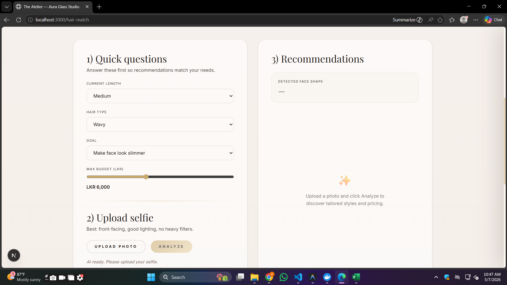
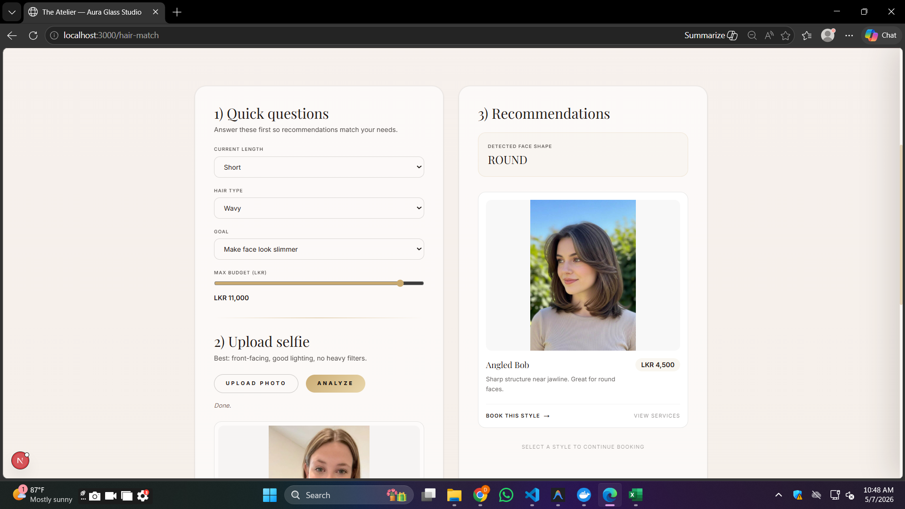

# ✨ AI-Powered Salon Platform 💇‍♀️🤖

> A modern full-stack salon management platform with an AI Hairstyle Match System built using **Next.js**, **FastAPI**, **PostgreSQL**, and **Docker**.

---

## 🌟 Overview

This project is a smart salon platform designed to combine traditional salon management features with AI-powered hairstyle recommendations.

Users can upload a selfie 📸 and receive hairstyle suggestions based on facial analysis using AI technologies.

The project was developed as a full-stack portfolio application focused on:
- scalable architecture ⚡
- AI integration 🤖
- modern frontend/backend development 💻
- containerized deployment 🐳

---

# 🚀 Main Features

## 🤖 AI Hairstyle Match System
✨ One of the core features of the platform

Users can:
- 📸 Upload a selfie
- 🧠 Analyze facial structure using AI
- 💇 Receive matching hairstyle recommendations
- 🖼️ View hairstyle previews
- 💲 See hairstyle pricing suggestions

---

## 💼 Salon Management Features

### 📅 Appointment Booking
- Book salon appointments
- Manage schedules
- View upcoming reservations

### 👥 Customer Management
- Store customer information
- Track appointments
- Manage customer records

### 🛠️ Service Management
- Add salon services
- Update pricing
- Organize categories

### 🔐 Authentication System
- Secure login and signup
- Protected routes
- Session handling

### 📊 Admin Dashboard
- Manage salon operations
- Monitor bookings and services
- Control application content

---

# 🧱 Tech Stack

## 🎨 Frontend
- ⚛️ Next.js
- 🎀 Tailwind CSS

## 🧠 Backend
- 🐍 Python
- 🚀 FastAPI

## 🗄️ Database
- 🐘 PostgreSQL

## 🐳 DevOps & Deployment
- Docker
- Docker Compose

## 🤖 AI Integration
- Google AI APIs
- Facial analysis workflow

---

# 🏗️ System Architecture

```text
📱 Next.js Frontend
          ↓
🚀 FastAPI Backend
          ↓
🐘 PostgreSQL Database
          ↓
🤖 Google AI Services
```

---

# 📂 Project Structure

```bash
frontend/             # Next.js frontend
backend/              # FastAPI backend
docker-compose.yml    # Docker services configuration
database/             # Database scripts & configs
screenshots/          # Project screenshots
```

---

# 🔥 AI Hairstyle Workflow

```text
1️⃣ User uploads selfie 📸
2️⃣ FastAPI backend processes image 🚀
3️⃣ AI analyzes facial structure 🧠
4️⃣ Matching hairstyles are generated 💇
5️⃣ Recommended styles & prices displayed ✨
```

---

# 📸 Screenshots
## 🏠 Home Screen


---
## 🤖 AI Hairstyle Upload Screen



---

## ✨ AI Hairstyle Recommendation Result



---

# 🎥 Demo Video

🎬 Watch Full Demo Here:

[▶️ Watch Demo Video](https://your-demo-link.com)

---

# ⚙️ Run Locally

## 📋 Requirements

- Docker
- Docker Compose
- Node.js
- Python 3.11+
- PostgreSQL

---

## ▶️ Start Application

```bash
docker-compose up --build
```

### 🌐 Frontend
```bash
http://localhost:3000
```

### 🚀 Backend API
```bash
http://localhost:8000
```

---

# 🧠 What I Learned

This project helped improve my experience in:

- Full-stack development 💻
- FastAPI backend architecture 🚀
- AI integration 🤖
- PostgreSQL database design 🐘
- Docker containerization 🐳
- Frontend/backend communication 🔄
- Scalable application structure ⚡

---

# 🌱 Future Improvements

- 🎨 Real-time hairstyle rendering
- 💳 Payment integration
- 📱 Mobile app version
- 🌍 Multi-language support
- 📊 Analytics dashboard
- ☁️ Full cloud AI deployment

---

# 💡 Portfolio Note

Some AI-powered features are currently demonstrated through screenshots and local testing environments due to cloud infrastructure and AI processing costs.

The complete architecture, backend logic, and AI workflow were fully developed and tested locally.

---

# ❤️ Built With Passion

This project represents my journey in:
- AI-powered applications
- modern web development
- backend engineering
- scalable system design

---

# 👨‍💻 Author

Developed as a personal full-stack portfolio project using modern technologies and AI-powered solutions ✨